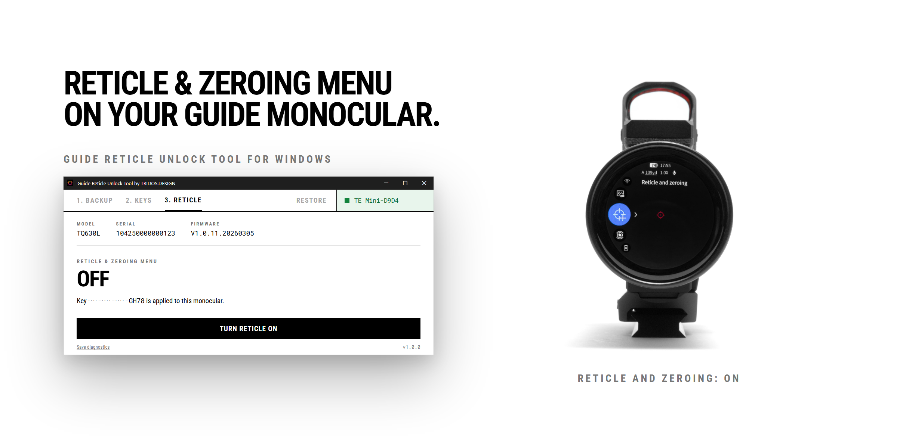

# Guide Reticle Unlock Tool

A small Windows app by TRIDOS.DESIGN that turns the **reticle and zeroing menu** on or off on a Guide thermal monocular. One licence key unlocks one monocular, permanently.

**[Download the latest version](https://github.com/trakaismikus/guide-unlock-tool-releases/releases/latest/download/GuideUnlockTool-setup.exe)** · [All versions](https://github.com/trakaismikus/guide-unlock-tool-releases/releases) · [Buy a licence key](https://tridos.design/products/guide-reticle-unlock-tool-license)

## What you need

- A Windows PC: Windows 10 (version 1803 or newer) or Windows 11, 64-bit, with Wi-Fi.
- About 10 MB of disk space. Nothing else to install.
- A Guide thermal monocular with Wi-Fi, from the ZG40 family (TE211, TE211M, TE411, TE421, TQ630L and their variants). The app checks the model when it connects. A model and firmware pair we have not confirmed yet gets a red warning and can still continue.
- A licence key. Buy one at [tridos.design](https://tridos.design/products/guide-reticle-unlock-tool-license). It arrives by email. Monoculars bought from TRIDOS have a free licence included; the app finds it by itself.

## Install

1. Download `GuideUnlockTool-setup.exe` from the link above.
2. Run it. Windows may show a blue **"Windows protected your PC"** box. That is Microsoft SmartScreen, which does not yet know this app. Click **More info**, check that the publisher reads **SIA TRIDOS**, then click **Run anyway**. The installer is signed and timestamped.
3. The app opens. Its version is shown bottom right.

## How to use it

The app has three numbered steps and a Restore tab. It never changes your PC's network settings; you join the Wi-Fi networks yourself.

### 1. Backup

1. On the monocular, turn Wi-Fi on.
2. On the PC, join the Wi-Fi named **TE Mini-…** (or similar). The password is usually `12345678`.
3. The app reads the monocular and saves a backup of its settings. Nothing on the monocular changes.

### 2. Keys

1. Leave the monocular's Wi-Fi and rejoin your normal Wi-Fi, the one with internet.
2. The monocular appears in the list. Press **Add key**, type the key from your email, press **Apply key**.
3. If the monocular has a free licence included, the row says so and no key is needed.

### 3. Reticle

1. Rejoin the monocular's Wi-Fi.
2. Press **Turn reticle on**. Read the two warnings, then press **Apply**.
3. When the app says **Done and checked**, turn the monocular off and on. The reticle and zeroing menu is there.

The same button turns it **off** again later. The key stays valid.

### Restore

Puts the monocular back to the settings it had the first time the app saw it. Connect the monocular on its Wi-Fi and open the tab. If the original backup is on this PC, the screen shows when it was taken and offers **Restore original settings**. If it is not, go online on your normal Wi-Fi for a moment first; the app fetches it.

## Good to know

- **Firmware updates are disabled and the warranty is likely void while the reticle is turned on.** The app says this before every write.
- Do not disconnect the monocular while the app is writing.
- If the app is not sure a write landed, it offers **Check again**, never a blind second write.
- A newer version is announced in the app's footer. When a version is required, the app asks you to update before anything else.
- **Save diagnostics** (bottom left of every screen) writes an encrypted log file to your Downloads folder. Send it to support if something goes wrong.

## Support

Email **mikus@tridos.design**. Include the monocular's model, serial number, and the diagnostics file if you have one.

© SIA TRIDOS · [TRIDOS.DESIGN](https://tridos.design)
